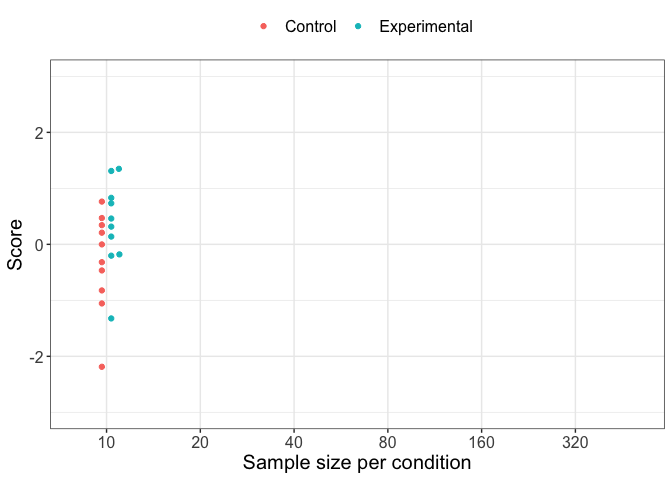
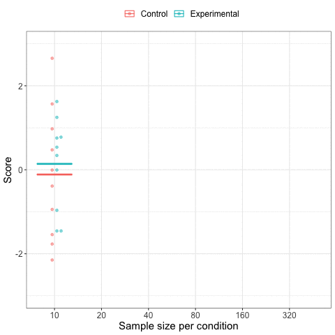

Version by DVM Bishop, July 2021  
Incorporating previous scripts by Adam Parker, June 2021  
(DVMB is less competent in tidyverse than AP, so this script has a mixture of styles!)  


## Pilot study 1  
For Pilot 1, 21 participants recruited via Prolific were given a version of the task that used gifs to show increasing sample sizes at 2 s intervals. Their task was to select a response (blue=pink or blue>pink) as soon as they were confident in their decision.  
<!--- https://ezgif.com/loop-count/ezgif-1-3270ca93d243.gif used to make gif play 100 times-->



There were 80 trials divided into 4 blocks of 20. They also did the original versions of pre- and post-test quizzes. 
There were 3 key differences in the training task between Pilot 1 and the final version of the task (which corresponds to Pilot 2):  

* The horizontal lines denoting sample means were omitted; judgments were based just on the beeswarms showing individual data points.  

* The beeswarm for each sample size was shown separately - the display appeared as a single beeswarm increasing in size as it moved across the screen - i.e. presentation was not cumulative, and so the fact that each new sample added to the previous one was not obvious.  

* Participants were compensated for doing the experiment, and they earned or lost points in relation to correct and error responses, but their financial reward was not linked to the points they earned.    

For the pilot 1 quiz (see analysis below), S-items 2 and 4 both involved questions involving proportions. In the version of the quiz for Registered Report, in response to a reviewer suggestion, questions about means were substituted to make the quiz more aligned with the training.  

The training game is here:  https://gorilla.sc/admin/project/5254#
Task draft, version 28  


```{r loadpackages, ,warnings=F, include=F, echo=F}
library(tidyverse)
library(ggplot2)
library(flextable)
library(stats)
library(psych)
library(psycho) #for d prime
```


```{r readraw, echo=F,include=F, }

# Raw data from training task are in two blocks, on https://osf.io/cmn92/
# These are raw output files created from Gorilla
# Files are public, so it should be possible to download them directlyn from OSF
dat1 <- read.csv('https://osf.io/hngry/download',stringsAsFactors = F)
dat2 <- read.csv('https://osf.io/m3uv7/download',stringsAsFactors = F)

all.dat <- rbind(dat1, dat2)
```


```{r checkraw,echo=F, include=F }
## Convert/check raw data format 
# This chunk was used just for some initial checks of the Gorilla output

#remove all but learning trials (defined by display 'beeswarms')
short.dat<-all.dat[all.dat$display=='beeswarms',]

#retain only Attempt
w<-which(short.dat$Attempt==1)
short.dat<-short.dat[w,]
#This should have 2400 values, but only has 2393 - some missing data? 
#Need to check if these were subjs who timed out without making a response.

#check RT distribution
#optional step to look at RT distribution. Set checkRTs to 1 to see histogram
checkRTs<- 0 

short.dat$Reaction.Time<-as.numeric(short.dat$Reaction.Time)
if(checkRTs==1){
short.dat$Reaction.Time[short.dat$Reaction.Time>30000]<-30000 #censor values at 30000
hist(short.dat$Reaction.Time, breaks=50)
abline(v=c(2000,4000,6000,8000,10000),col='red')
}


#code array index according to reaction time (array that is reached on gif at this RT)
short.dat$array= as.numeric(cut(short.dat$Reaction.Time, breaks= c(0,2000,4000,6000,8000,10000,Inf), labels = c("1","2","3","4","5","6")))

#Check scoring worked OK.

table(short.dat$Correct,short.dat$ANSWER,short.dat$Response)


```

<!---Generic functions follow that do similar computations for all pilots-->

```{r crunchingdata, include=F,echo=F}

# To start, we crunch data down to remove all but key columns and rows

datacrunch <- function(mydata,subdataname,pilot){  #mydata is a raw file from Gorilla with all participants
  #subdataname will be used to store the original Participant code and new shorter ID lookup; pilot specifies which pilot: 1, 2 or 3
  pilotdat<-mydata #skip next steps for pilot 3, which is already processed
  if (pilot<3){
    pilotdat <- mydata[mydata$Screen.Name=='Stimulus1',]
    allcols<-colnames(pilotdat)
    
    #need to rename columns with older naming style (PIlot 1 only)
    w<-which(allcols %in% c('ES1','ES2','ES3','ES4','ES5','ES6'))
    if(length(w)>0){
      colnames(pilotdat)[w]<-c('ObsE1','ObsE2','ObsE3','ObsE4','ObsE5','ObsE6')
    }
    if(pilot!=2){pilotdat$bonus <- 0} #we need to create dummy bonus column for pilots 1 and 3, in order to read file properly. Bonus is used to compute earnings. 
    #We set it to zero for Pilots with no bonus, so condition for awarding bonus is never met.
    
    wantcols<-c('Participant.Public.ID','Spreadsheet.Row','Trial.Number','Reaction.Time',
                'Response','Correct','ES','EarningCorrect','EarningWrong','meanC1','meanE1',
                'meanC2','meanE2','meanC3','meanE3','meanC4','meanE4','meanC5','meanE5','meanC6','meanE6',
                'ObsE1' ,'ObsE2','ObsE3','ObsE4','ObsE5','ObsE6',
                'LL1' ,'LL2','LL3','LL4','LL5','LL6',
                't1' ,'t2','t3','t4','t5','t6','bonus')
    
    #this version retains information about means and LL etc, which can be useful for looking at strategies - in particular can see for each trial how response is affected by observed effect size or LL. 
    pilotdat<-pilotdat[,wantcols]
  }
  pilotdat$choice<-NA
  pilotdat$choice[pilotdat$Response=='Blue=Pink']=1
  pilotdat$choice[pilotdat$Response=='Blue>Pink']=2
  pilotdat$choice<-as.factor(pilotdat$choice)
  
  pilotdat$ID <-as.factor(pilotdat$Participant.Public.ID)
  
  levels(pilotdat$ID)<-paste0('s',1:length(levels(pilotdat$ID))) #need to add 's' to avoid confusion because these are not created in numeric order
  sublookup <- as.data.frame(cbind(pilotdat$ID,pilotdat$Participant.Public.ID))
  sublookup <- sublookup[!duplicated(sublookup$V1),]
  colnames(sublookup)<-c('Number','code')
  #We need to retain a lookup file linking Participant.Public.Id and number so we can link questionnaire data to training data
  write.csv(sublookup,subdataname,row.names=F)
  
  pilotdat$Reaction.Time <- as.integer(pilotdat$Reaction.Time)
  pilotdat$Trial.Number<-as.numeric(pilotdat$Trial.Number)
  pilotdat$half <- 1 #for this dataset, we initially just compared 1st and 2nd halves
  pilotdat$half[pilotdat$Trial.Number > 40]<-2
  #convert RT to choice
  mybreaks<-c(0,2000,4000,6000,8000,10000,Inf)
  if(pilot<3){
    pilotdat$array <- as.numeric(cut(pilotdat$Reaction.Time,
                                     breaks=mybreaks,
                                     labels=1:6))
  }
  
  #Compute earnings for each trial
pilotdat$earn<-pilotdat$EarningWrong #default is error
for (r in 1:nrow(pilotdat)){
  if(pilotdat$Correct[r]==1){
    pilotdat$earn[r]=pilotdat$EarningCorrect[r]
  }
}
# Compute bonus earning for Pilot 2. Extra earned if selected array = bonus; i.e. if the optimal array size was selected.
#NB the bonus is fixed at 2 points and hard coded here, not read from file.
#Because bonus is NA for pilots 1 and 2, this chunk will have no effect
w<- which(pilotdat$array==pilotdat$bonus)
pilotdat$earn[w]<-pilotdat$earn[w]+2


#convert trial number into block.
pilotdat$Trial.Number<- as.numeric(pilotdat$Trial.Number)
triallist <- unique(short.dat$Trial.Number) #confirm there are 80 values

pilotdat$block<-1
w<- which(pilotdat$Trial.Number %in% triallist[21:40])
pilotdat$block[w]<-2
w<- which(pilotdat$Trial.Number %in% triallist[41:60])
pilotdat$block[w]<-3
w<- which(pilotdat$Trial.Number %in% triallist[61:80])
pilotdat$block[w]<-4

# table(short.dat$ID,short.dat$block)
#All OK: all subs have trials in a block 
  
  #The remander of this chunk allows for an in-depth analysis of individual subjects' responses, including a plot for each one. This is retained for possible future use, but not used here.
 
  #need to find optimal array - i.e. the one where absLL> LLcutoff
# this is already stored for Pilot 2, where it is used to compute bonus
  #LLcutoff can be specified as we choose
  LLcutoff <- 3.68 #one hypoth 40 times more likely than the other
  L1 <- which(colnames(pilotdat)=='LL1')
  pilotdat$optarray<-NA
  for (j in 1:nrow(pilotdat)){
    optimal <- which(abs(pilotdat[j,L1:(L1+5)])>LLcutoff)
    ifelse(length(optimal)==0,optimal <-6,optimal<-optimal[1])
    pilotdat$optarray[j]<-optimal
    
  }
  pilotdat$arraydiff<-pilotdat$array-pilotdat$optarray
  #just check this worked!
  #aggregate(pilotdat$Reaction.Time ,by= list(pilotdat$array),FUN=mean)
  
  #Now we assemble the other relevant information for this trial
  
  startmeans <- which(colnames(pilotdat)=='meanC1')
  startES <-which(colnames(pilotdat)=='ObsE1')
  startLL <-which(colnames(pilotdat)=='LL1')
  startt <-which(colnames(pilotdat)=='t1')
  for (i in 1:nrow(pilotdat)){
    mynum<-pilotdat$array[i]
    pilotdat$Cmean[i] <- pilotdat[i,(startmeans-2+2*mynum)]
    pilotdat$Emean[i] <- pilotdat[i,(startmeans-1+2*mynum)]
    pilotdat$ESobs[i] <- pilotdat[i,(startES-1+mynum)]
    pilotdat$LL[i] <- pilotdat[i,(startLL-1+mynum)]
    if(pilotdat$LL[i]==Inf){pilotdat$LL[i] <-500} #how to handle infinity values? Here put to 500
    pilotdat$t[i] <- pilotdat[i,(startt-1+mynum)]
  }
  #code ES suitable to use it as colour
  pilotdat$EScol <- 1
  pilotdat$EScol[pilotdat$ES==0] <-4.5 
  
  myag <- aggregate(pilotdat$Correct,b=list(pilotdat$ES,pilotdat$Correct,pilotdat$ID),FUN=length)
  colnames(myag)<-c('TrueEff','Correct','ID','N')
  
  myag2 <- aggregate(pilotdat$array,b=list(pilotdat$ES,pilotdat$Correct,pilotdat$ID),FUN=mean)
  colnames(myag2)<-c('TrueEff','Correct','ID','array')
  myag3 <- aggregate(pilotdat$LL,b=list(pilotdat$ES,pilotdat$Correct,pilotdat$ID),FUN=mean)
  colnames(myag3)<-c('TrueEff','Correct','ID','LL')
  myag4 <- aggregate(pilotdat$ESobs,b=list(pilotdat$ES,pilotdat$Correct,pilotdat$ID),FUN=mean)
  colnames(myag4)<-c('TrueEff','Correct','ID','ESobs')
  
  myag<-cbind(myag,myag2[,4],myag3[,4],myag4[,4])
  colnames(myag)[5:7]<-c('array','LL','ESObs')
  
  nsub<-length(levels(pilotdat$ID))
  subs<-unique(pilotdat$ID)
  
  myag$p.corr <- NA
  #work out p.correct and write against first row for subject
  #NB some may make no errors in one category so can't assume 4 rows in myag for all
  for (i in 1:nsub){
    w<-which(myag$ID==subs[i])
    ww<-intersect(w,which(myag$Correct==1))
    myag$p.corr[w[1]]<-sum(myag$N[ww])/sum(myag$N[w])
  }
  
  nitem<-nrow(pilotdat)/nsub
  return(list(pilotdat,myag))
}
```

```{r meanstablefunction, include=F, echo=F}
#Make table of means by block
meanstable<-function(summaryfile,pilot){
  mycols<-c('dprime1','dprime2','dprime3','dprime4',
            'pcorr1','pcorr2','pcorr3','pcorr4',
            'array1','array2','array3','array4',
            'earn1','earn2','earn3','earn4',
            'b4_b1_acc','acc.slope')
shortfile<-summaryfile[,mycols]
mytab<-round(describe(shortfile),2)
format.tab<- cbind(1:4,mytab[5:8,3:4],mytab[1:4,3:4],mytab[9:12,3:4],mytab[13:16,3:4])
colnames(format.tab)<- c('block','pcorr.m','pcorr.sd','dprime.m','dprime.sd','array.m','array.sd','earn.m','earn.sd')
row.names(format.tab)<-NULL
return(format.tab)
}


```


```{r plot-learn,warnings=F, include=F,echo=F}
plotlearning <- function(mydata,pilot){
# accuracy per half
p.agg <- mydata %>% 
  group_by(ID, block) %>% 
  summarise(meanAcc = mean(Correct))
# visualize
myplot<-ggplot(p.agg, aes(x = block, y = meanAcc, color = as.factor(ID), group = as.factor(ID))) + 
  geom_point(size= 2.5) + geom_line() + 
  theme_bw(18) +
  ylab("Proportion correct") +
  xlab("Block") +
  ggtitle(paste0(" Pilot ",pilot)) +
  theme(legend.position = "none")
return(myplot)
}

```

```{r checklearning, include=F, echo=F}
checklearn <- function(summaryfile){
t1<-  t.test(summaryfile$b4_b1_acc)

t2<-  t.test(summaryfile$acc.slope)

t3<-  t.test(summaryfile$array4,summaryfile$array1)
  
return(list(t1,t2,t3))  
}


```
```{r checkcorrel, include=F, echo=F}
checkcorrel <- function(summaryfile){
r1 <- cor.test(summaryfile$pcorr1,summaryfile$array1)
r2 <- cor.test(summaryfile$pcorr2,summaryfile$array2)
r3 <- cor.test(summaryfile$pcorr3,summaryfile$array3)
r4 <- cor.test(summaryfile$pcorr4,summaryfile$array4)
summaryfile$allpcorr <- summaryfile$pcorr1+summaryfile$pcorr2+summaryfile$pcorr3+summaryfile$pcorr4
summaryfile$allarray <- summaryfile$array1+summaryfile$array2+summaryfile$array3+summaryfile$array4
r0 <- cor.test(summaryfile$allpcorr,summaryfile$allarray)

x1 <- round(r1$estimate,3)
low1 <-round(r1$conf.int[1],3)
hi1 <-round(r1$conf.int[2],3)
c1 <- paste0(x1," (",low1," to ", hi1, ")")

x2 <- round(r2$estimate,3)
low1 <-round(r2$conf.int[1],3)
hi1 <-round(r2$conf.int[2],3)
c2 <- paste0(x2," (",low1," to ", hi1, ")")

x3 <- round(r3$estimate,3)
low1 <-round(r3$conf.int[1],3)
hi1 <-round(r3$conf.int[2],3)
c3 <- paste0(x3," (",low1," to ", hi1, ")")

x4 <- round(r4$estimate,3)
low1 <-round(r4$conf.int[1],3)
hi1 <-round(r4$conf.int[2],3)
c4 <- paste0(x4," (",low1," to ", hi1, ")")

x0 <- round(r0$estimate,3)
low1 <-round(r0$conf.int[1],3)
hi1 <-round(r0$conf.int[2],3)
c0 <- paste0(x0," (",low1," to ", hi1, ")")

mydf <-rbind(c1,c2,c3,c4,c0)
mydf <- as.data.frame(cbind(c('Block1','Block2','Block3','Block4','All Blocks'),mydf))
colnames(mydf)<-c('Block','Correlation (95% CI)')

return(mydf) 
}


```


```{r pilot1crunch, include=F, echo=F}
#For Pilot1 we run this code as follows:
mypilotag <- datacrunch(all.dat,'sublookup.csv',1) #2nd term is name where subject ID codes are saved.
pilotdat1 <- mypilotag[[1]]
myag1<- mypilotag[[2]]
```

```{r individual-plots, include=F, echo=F}
# This code chunk can be used to plot trial by trial responses for each subject, and see how they relate to LL, observed effect size and array size. This option currently disabled.

doplots <- 0 #set doplots to 1 to create plots 

if (doplots==1){
  
  pilotdat$corrpch <- 15 #pch code for correct/incorrect are blob and x
  pilotdat$corrpch[pilotdat$Correct==0]<-4
  
  
  pdfname <- 'subplotsx.pdf'
  
  pdf(pdfname,width=6, height=6)
  par(mfrow=c(3,3))
  mypcorr<-vector()
  
    subs<-unique(myag$ID)
    nsub<-length(subs)
  for (n in 1:nsub){
    mypcorr[n]<-myag$p.corr[myag$ID==subs[n]][1]
  }
  
  for (n in 1:nsub){ #order them by accuracy
    
    subdat<-pilotdat[pilotdat$ID==subs[n],]
    plot(subdat$Trial.Number,subdat$LL,col=(subdat$EScol),pch=subdat$corrpch,main=subs[n],type='b',ylim=c(-20,20))
    abline(h=0,lty=2)
    
    plot(subdat$Trial.Number,subdat$ESobs,col=(subdat$EScol),pch=subdat$corrpch,main=subs[n],type='b',ylim=c(-1,1))
    abline(h=0,lty=2)
    text(20,.8,paste0('p.correct: ',round(mypcorr[n],3)),cex=.8)
    
    tt<-t.test(subdat$array[1:20], mu = 4, alternative = "greater")
    plot(subdat$Trial.Number,subdat$array,col=(subdat$EScol),pch=subdat$corrpch,main=subs[n],type='b',ylim=c(1,6))
    text(15,1.5,paste0('p half1 index> 4: ',round(tt$p.value,3)),cex=.8)
    
    #Is E or ES a better predictor of accuracy?
    #Need to divide by trueES - not getting v far with this
    ESag <- aggregate(subdat$ESobs, by = list(subdat$ES,subdat$Correct),FUN=mean)
    Eag <- aggregate(subdat$Emean, by = list(subdat$ES,subdat$Correct),FUN=mean)
  }
  dev.off()
  
}

#Further analysis of Pilot1 data was done to compare results for blocks 1-2 and 3-4.  This is in the old script LawSmallNums_prereg.Rmd, where there is a chunk called 'byhalf'. This generally showed no indication of learning.
```

```{r chanceperformance, include=T,echo=F}
#We vary n to find appropriate value from a range of possible Ns. 
#This is just done by inspecting pp values for different ns
for (n in 41:50){
  pp <- 1-pbinom(n, 80, .5, lower.tail = TRUE, log.p = FALSE)
}

#47/80 is above chance at .05

#This is .5875 correct

#binomial probs for 2nd half only
for (n in 21:29){
  pp <- 1-pbinom(n, 40, .5, lower.tail = TRUE, log.p = FALSE)

}
#25/40 is above chance at .05
#This is .625 correct
```


```{r readquiz, echo=F,include=T,}
# read in pre and post data
# NB will need to check all quiz items categorisation and correct answers before applying to new dataset.
pre_data_A <- read.csv('https://osf.io/u6n39/download',stringsAsFactors = F)
pre_data_B <- read.csv('https://osf.io/8a39z/download',stringsAsFactors = F)
post_data_A <- read.csv('https://osf.io/ryxcj/download',stringsAsFactors = F)
post_data_B <- read.csv('https://osf.io/qz5xu/download',stringsAsFactors = F)

# create new variables coding time point
pre_data_A$time <- 1
pre_data_B$time <- 1
post_data_A$time <- 2
post_data_B$time <- 2
# create a new variable to code list
pre_data_A$list <- "A"
pre_data_B$list <- "B"
post_data_A$list <- "A"
post_data_B$list <- "B"
# merge two data frames
qdata <- bind_rows(pre_data_A, post_data_A, pre_data_B, post_data_B)
# create factor variables
qdata$ID <- as.factor(qdata$Participant.Private.ID)
qdata$item <- as.factor(qdata$Question.Key)
qdata$time <- as.factor(qdata$time)
levels(qdata$time) <- c("Pre", "Post")
```


```{r codeQs, echo=F,include=F}
# Code the correct answers.
# select only numerical responses
qdata <- qdata[qdata$Response == "1" |
                 qdata$Response == "2" |
                 qdata$Response == "3" |
                 qdata$Response == "4",]
# code question accuracy
qdata  <- 
  qdata %>%
  mutate(accuracy = ifelse(Question.Key == "1a-quantised" & Response =="1", 1, 
                           ifelse(Question.Key == "1b-quantised" & Response =="1", 1,
                                  ifelse(Question.Key == "2a-quantised" & Response =="1", 1,
                                         ifelse(Question.Key == "2b-quantised" & Response =="1", 1,
                                                ifelse(Question.Key == "3a-quantised" & Response =="4", 1,
                                                       ifelse(Question.Key == "3b-quantised" & Response =="1", 1,
                                                              ifelse(Question.Key == "4a-quantised" & Response =="4", 1,
                                                                     ifelse(Question.Key == "4b-quantised" & Response =="4", 1,
                                                                            ifelse(Question.Key == "5a-quantised" & Response =="4", 1,
                                                                                   ifelse(Question.Key == "5b-quantised" & Response =="1", 1,        
                                                                                          ifelse(Question.Key == "6a-quantised" & Response =="1", 1,
                                                                                                 ifelse(Question.Key == "6b-quantised" & Response =="2", 1,      
                                                                                                        ifelse(Question.Key == "7a-quantised" & Response =="4", 1,      
                                                                                                               ifelse(Question.Key == "7b-quantised" & Response =="4", 1,     
                                                                                                                      ifelse(Question.Key == "8a-quantised" & Response =="3", 1,      
                                                                                                                             ifelse(Question.Key == "8b-quantised" & Response =="3", 1,    
                                                                                                                                    ifelse(Question.Key == "9a-quantised" & Response =="3", 1,    
                                                                                                                                           ifelse(Question.Key == "9b-quantised" & Response =="3", 1,   
                                                                                                                                                  ifelse(Question.Key == "10a-quantised" & Response =="3", 1,      
                                                                                                                                                         ifelse(Question.Key == "10b-quantised" & Response =="3", 1,       
                                                                                                                                                                ifelse(Question.Key == "11a-quantised" & Response =="1", 1,      
                                                                                                                                                                       ifelse(Question.Key == "11b-quantised" & Response =="1", 1,      
                                                                                                                                                                              ifelse(Question.Key == "12a-quantised" & Response =="2", 1, 
                                                                                                                                                                                     ifelse(Question.Key == "12b-quantised" & Response =="1", 1, 0)))))))))))))))))))))))))
# code question type
qdata  <- 
  qdata %>%
  mutate(Prob = ifelse(Question.Key == "2a-quantised" | Question.Key == "2b-quantised" | 
                         Question.Key == "4a-quantised" | Question.Key == "4b-quantised" | 
                         Question.Key == "7a-quantised" | Question.Key == "7b-quantised" | 
                         Question.Key == "8a-quantised" | Question.Key == "8b-quantised" | 
                         Question.Key == "9a-quantised" | Question.Key == "9b-quantised" | 
                         Question.Key == "11a-quantised" | Question.Key == "11b-quantised",
                       "SampleSize", "Probability"))
qdata$Prob <- as.factor(qdata$Prob)
```

```{r mapsubjectcodes,echo=F,include=F}
sublookup <- read.csv("sublookup.csv") #these are codes from training session - need to be matched to same people
qdata$subID <-NA
for (i in 1:nrow(sublookup)){
  w<-which(qdata$Participant.Public.ID ==sublookup$code[i] )
  qdata$subID[w] <- paste0('s',sublookup$Number[i])
}
```

 

```{r qdatainspect, include=T,echo=F}

### Create a table showing the distribution of responses to each question. 
# This is saved as questresults. 
qdata$item<-droplevels(qdata$item)
qt <- table(qdata$item,qdata$Response)
qdf <- as.data.frame(unclass(qt))
qtype <- table(qdata$item,qdata$Prob)
qdf<-cbind(qdf,unclass(qtype))
qdf$Probability[qdf$Probability>0]<-1
qdf<-qdf[,1:ncol(qdf)-1]
orderq <- c(7,9,11,13,15,17,19,21,23,1,3,5,
            8,10,12,14,16,18,20,22,24,2,4,6)
qdf <- qdf[orderq,]

qdf$Answer <- c(1,1,4,4,4,1,4,3,3,3,1,2,2,1,1,4,1,2,4,3,3,3,1,1)
colnames(qdf)[1:5]<-c('R1','R2','R3','R4','Probquest')
qdf$perc.c<-NA
for (i in 1:nrow(qdf)){
  qdf$perc.c[i] <- qdf[i,qdf$Answer[i]]/21
}

write.csv(qdf,'questresults.csv')


```


 
```{r summarytable, include=T,echo=F,message =F}
## Create summary table, with learning data, and questionnaire data if available.
#We do this in a function, so it can be reapplied to new data.  
makesummary <- function(pilotdat, haveQdata, summaryname){
  if (haveQdata==1){ #omit this step if haveQdata is zero
    qag <- aggregate(qdata$accuracy, by=list(qdata$time,qdata$Prob,qdata$subID),FUN=mean)
    colnames(qag)<-c('prepost','type','ID','qscore')
  }
  nsub<-length(unique(pilotdat$ID))
  allcol <- c('ID', 'PreQ.S', 'PostQ.S', 'PreQ.P', 'PostQ.P', 'NcorrN1', 'Nhit1', 'Miss1', 'FP1', 'dprime1', 'beta1', 'pcorr1', 'array1','earn1', 'NcorrN2', 'Nhit2', 'Miss2', 'FP2', 'dprime2', 'beta2', 'pcorr2', 'array2','earn2', 'NcorrN3', 'Nhit3', 'Miss3', 'FP3', 'dprime3', 'beta3', 'pcorr3', 'array3','earn3', 'NcorrN4', 'Nhit4', 'Miss4', 'FP4', 'dprime4', 'beta4', 'pcorr4', 'array4','earn4')
  
  pilotsummary<-data.frame(matrix(NA,nrow=nsub,ncol=length(allcol)))
  colnames(pilotsummary)<-allcol
  
  
  namelist <- c('NcorrN','Nhit','Miss','FP')
  for (s in 1:nsub){
    thissub <- paste0('s',s)
    if(haveQdata==1){
      w<-which(qag$ID==thissub)
      thisbit<-qag[w,]
  
      pilotsummary[s,2:3]<-thisbit[3:4,4]
      pilotsummary[s,4:5]<-thisbit[1:2,4]
    }
     pilotsummary[s,1]<-thissub
    #now add Ncorrect, hit, miss, fp for each block
    thatbit <- pilotdat[pilotdat$ID==thissub,]
    for (b in 1:4){
      cnames <- paste(namelist,b,sep='')
      bcols<-which(colnames(pilotsummary) %in% cnames) #cols to write to
      dpcols<-c(max(bcols)+1,max(bcols)+2,max(bcols+3),max(bcols+4),max(bcols+5)) #cols to write dprime and beta to
      bbit <- thatbit[thatbit$block==b,]
      #N correct negs
      x1 <- length(intersect(which(bbit$choice==1),which(bbit$Correct==1))) #correct negative
      x2 <- length(intersect(which(bbit$choice==2),which(bbit$Correct==1))) #correct positive (hit)
      x3 <- length(intersect(which(bbit$choice==1),which(bbit$Correct==0))) #miss 
      x4 <- length(intersect(which(bbit$choice==2),which(bbit$Correct==0))) #false positive
      pilotsummary[s,bcols]<-c(x1,x2,x3,x4)
      pilotsummary[s,dpcols[1:2]]<-psycho::dprime(x2,x4,x3,x1)[1:2]
      pilotsummary[s,dpcols[3]]<-(x1+x2)/(x1+x2+x3+x4)
      pilotsummary[s,dpcols[4]]<- mean(bbit$array)
       pilotsummary[s,dpcols[5]]<- mean(bbit$earn)
    }
    
  }
  #NB in the original file on OSF, misses and FPs were the wrong way round (this affected beta but not dprime)
  
  #Add difference score for block4 - block1 for accuracy, and also slope
  pilotsummary$b4_b1_acc <- pilotsummary$pcorr4-pilotsummary$pcorr1
  pilotsummary$abovechanceH1<-0
   pilotsummary$abovechanceH2<-0
  for (i in 1:nrow(pilotsummary)){
    accvals<-c('pcorr1','pcorr2','pcorr3','pcorr4')
    accs <- as.data.frame(cbind(t(pilotsummary[i,accvals]),1:4))
    colnames(accs)<-c('y','x')
    mylm <- lm(accs$y~accs$x)
    pilotsummary$acc.slope[i] <- coefficients(mylm)[2]
    half1corr<-pilotsummary$Nhit1[i]+pilotsummary$NcorrN1[i]+pilotsummary$Nhit2[i]+pilotsummary$NcorrN2[i]
    half2corr<-pilotsummary$Nhit3[i]+pilotsummary$NcorrN3[i]+pilotsummary$Nhit4[i]+pilotsummary$NcorrN4[i]
    if(half1corr>24){ pilotsummary$abovechanceH1[i]<-1}
    if(half2corr>24){ pilotsummary$abovechanceH2[i]<-1}
  }
  
  write.csv(pilotsummary,summaryname,row.names=F)
  return(pilotsummary)
}


```
## Overview of results on learning task

```{r summaryPilot1, echo=F,include=T, message=F,warning=F}
pilot1summary<-makesummary(pilotdat1, 1, 'Pilot1summary.csv')
means1 <- meanstable(pilot1summary,1)
ft<-flextable(means1)
ft <- set_caption(ft, caption = "Pilot 1: Mean (SD) by block")
ft

chancetab<-table(pilot1summary$abovechanceH1,pilot1summary$abovechanceH2)
```

The processed results from the learning task for Pilot 1 are available in Pilot1summary.csv (https://osf.io/gk2ay/files/).  
Overall means by block are shown for proportion correct (p.corr), d.prime, array index at time of response (array: ranges from 1 to 6), and earnings (multiply by 20 to get amount earned in pence).  
Note that for pilot 1, p.corr and earnings are perfectly correlated. In addition, there is very little difference between dprime and pcorr, reflecting the fact that there was no sign of systematic response bias. 

A score of 25/40 (62.5%) is better than chance performance (binomial probability = .040). `r chancetab[1,1]` participants did no better than chance on both first and second halves of training (blocks 1-2 and blocks 3-4), `r chancetab[2,2]` participants did better than chance on both halves. `r chancetab[2,1]` participants did better than chance on the first half but not on the second half, and `r chancetab[1,2]` performed at chance on the first half and better on the second half. 

```{r doplot1,echo=F,include=T,message=F}
plotlearn1<-plotlearning(pilotdat1,1)
plotlearn1
```


The plot above shows accuracy for individual participants by block. On inspection, slopes for individual participants are fairly mixed with some appearing to increase, but others going in the opposite direction. Overall means by block do not suggest any learning.  

Overall, the pilot data suggested the task was too difficult to lead to learning, and it was accordingly decided to change the displays of distributions to include bars corresponding to the means for the two groups. Informal piloting with colleagues suggested this led to an increase in accuracy.


## Overview of results on quiz

The distribution of responses to each question is saved as questresults.csv (see OSF) and reproduced below.   


```{r showquiz,echo=F,include=T}
qdf<-qdf[order(qdf$Probquest),]
pqdf <- cbind(row.names(qdf),qdf)
colnames(pqdf)[1] <- 'Item'
pqdf$Item<-substr(pqdf$Item,1,3)
pqdf$perc.c<-round(pqdf$perc.c,3)
colnames(pqdf)[6:8]<-c('P-item','Correct resp.','Prop.correct')
ft<-flextable(pqdf)
ft <- set_caption(ft, caption = "Pilot 1: Responses to quiz")
ft

```

We predicted that S-items would be harder than P-items on the quiz. This is the case for both pre and post-test.

```{r quiztypecompare, echo=F,include=T}
t.test(pilot1summary$PreQ.S,pilot1summary$PreQ.P,paired=T)
t.test(pilot1summary$PostQ.S,pilot1summary$PostQ.P,paired=T)
```
We check whether there is any indication of gain on the quiz. There was no difference on t-test for either S or P items.  

```{r quizgain, echo=F,include=T}
t.test(pilot1summary$PostQ.S,pilot1summary$PreQ.S,paired=T)
t.test(pilot1summary$PostQ.P,pilot1summary$PreQ.P,paired=T)
```

We then considered whether the post-training score on quiz questions is predicted by proportion correct at the end of training, after allowing for PreQuiz score. This prediction was specific for S-items. There was no evidence this is the case for either S- or P-items. Quiz post-test scores on S-items were strongly predicted by pretest scores. 

```{r predictQgain, echo=F,include=T}
mod_predictS <- lm(PostQ.S ~ PreQ.S+pcorr4,data=pilot1summary)
summary(mod_predictS)
mod_predictP <- lm(PostQ.P ~ PreQ.P+pcorr4,data=pilot1summary)
summary(mod_predictP)
```
### Correlations between percent correct and accuracy across blocks  

```{r corpilot1, echo=F,include=T}
cors1 <- checkcorrel(pilot1summary)
ft<-autofit(flextable(cors1))
ft <- set_caption(ft, caption = "Pilot 1: Correlation of proportion correct with array index by block")
ft
```

# Pilot data 2  
A revised version of the training task was given to 30 participants recruited via Prolific. Modifications from pilot 1 were as follows:  
  
*  The gif beeswarms showed a horizontal line corresponding to the mean for each group.  

*  Each gif remained on display as the next one was added, to make it clear that the samples were cumulative.  

*  A reward schedule was devised so that bonus points were awarded if the 'optimal' array was selected. This corresponded to the array where the odds in favour of either the null or true hypothesis reaches 40:1 (absolute log likelihood of 3.68).  

* Points earned in the game were converted to pennies that were added to the baseline payment. (But negative points were not subtracted). 


  

These participants were not given the quiz, as we felt we had already evaluated it adequately.  We did, however, ask them for subjective report of how they approached the task at the end of the session. 


```{r readraw2, include=F, echo=T,message=F}

# Raw data from training task are in two blocks, on https://osf.io/g2ks6/
# These are raw output files created from Gorilla
# Files are public, so it should be possible to download them directly
dat1b <- read.csv('https://osf.io/qvyxt/download',stringsAsFactors = F)
dat2b <- read.csv('https://osf.io/pmq2g/download',stringsAsFactors = F)

all.datb <- rbind(dat1b, dat2b)
```

```{r pilot2crunch, include=F, echo=F}
#For Pilot2 we run this code as follows:
mydata <- all.datb
subdataname <- 'sublookup2.csv'
mypilotag <- datacrunch(mydata,subdataname,2)  #2nd term is name where subject ID codes are saved.
pilotdat2 <- mypilotag[[1]]
myag <- mypilotag[[2]]
```

```{r summaryPilot2, include=T, echo=F}
pilot2summary<-makesummary(pilotdat2, 0, 'Pilot2summary.csv') #2nd term set to zero as we have no questionnaire data.
means2 <- meanstable(pilot2summary,2)
ft<-flextable(means2)
ft <- set_caption(ft, caption = "Pilot 2: Mean (SD) by block")
ft

chancetab<-table(pilot2summary$abovechanceH1,pilot2summary$abovechanceH2)

```
The processed results from the learning task for Pilot 2 are available in Pilot2summary.csv (https://osf.io/rqa9d/).  

Overall means by block are shown for proportion correct (p.corr), d.prime, array index at time of response (array: ranges from 1 to 6), and earnings (multiply by 20 to get amount earned in pence).  
Because of the bonus scheme, p.corr and earnings are not perfectly correlated, but they are very close. 
<!--- NB I have not computed earnings with bonuses yet!-->

A score of 25/40 (62.5%) is better than chance performance (binomial probability = .040). `r chancetab[1,1]` participants did no better than chance on both first and second halves of training (blocks 1-2 and blocks 3-4), `r chancetab[2,2]` participants did better than chance on both halves. `r chancetab[2,1]` participants did better than chance on the first half but not on the second half, and `r chancetab[1,2]` performed at chance on the first half and better on the second half. 


```{r doplot2,echo=F,include=T}
plotlearn2<-plotlearning(pilotdat2,2)
plotlearn2
```

The plot and the means table suggest that learning occurred between blocks 1 and 2. Note that the overall final proportion correct is higher than in Pilot 1. However, there is little indication that the array index changes as learning occurs.  Indeed, many participants responded at a close-to-optimal array index throughout the session, so array index was relatively constant, although accuracy improved. These impressions were tested using t-tests. Note that we compared two indices of learning: the difference between accuracy on block 4 vs block 1, and the slope of accuracy against block for all 4 blocks. They gave very similar results.

```{r checklearning2, echo=F,include=T,message=F }

learn2<-checklearn(pilot2summary) 
print('Test whether block4 - block1 accuracy differs from zero')
learn2[[1]]
print('Test whether slope across 4 blocks for accuracy differs from zero')
learn2[[2]]
print('Test whether block4-block1 array index differs from zero')
learn2[[3]]

```
### Correlations between percent correct and accuracy across blocks  

```{r corpilot2, echo=F,include=T}
cors2 <- checkcorrel(pilot2summary)
ft<-autofit(flextable(cors2))
ft <- set_caption(ft, caption = "Pilot 2: Correlation of proportion correct with array index by block")
ft
```

### What strategies did participants employ?

Here, participants were asked *Did you change how you approached the task? Please let us know if you adopted any specific strategy to guide your response?*  

Responses are shown below, with "+" against any that indicate awareness of need to wait for larger sample size.  

*NOTE*. Only 26 received the follow up questionnaire due to an issue in Gorilla. This is now fixed. 

```{r strategy, echo=F, include=T, message=F}
strat.dat  <- read.csv('https://osf.io/pqx2c/download',stringsAsFactors = F)
  
# subjective improvement
improve <- strat.dat %>%
  filter(Question.Key== "better.over.time")
# counts

table(improve$Response)
# filter
strat.dat <- strat.dat %>%
  filter(Question.Key== "approach.feedback")

#manually coded according to whether any mention of using sample size
briefcode <- c(1,0,0,0,1,1,1,1,0,0,1,0,1,0,0,1,0,1,1,0,1,1,1,0,0,1)
# list
mysymbol<-c('-','+')
print(paste(mysymbol[(briefcode+1)],strat.dat$Response))

sublookup <- read.csv("sublookup2.csv") #these are codes from training session - need to be matched to same people
strat.dat$subID <-NA
for (i in 1:nrow(sublookup)){
  w<-which(strat.dat$Participant.Public.ID ==sublookup$code[i] )
  strat.dat$subID[w] <- paste0('s',sublookup$Number[i])
}
pilot2summary$strategy<-NA
pilot2summary$strategycode <- NA

  for (i in 1:nrow(strat.dat)){
    w<-which(pilot2summary$ID==strat.dat$subID[i])
    pilot2summary$strategy[w]<-strat.dat$Response[i]
    pilot2summary$strategycode[w]<-briefcode[i]
  }


```


21 participants reported that they had improved over time, with 1 saying they did not and 4 saying they were unsure. The qualitative questions were coded as 0 or 1 depending on whether or not they indicated an awareness that waiting and/or sample size was important. A few participants didn't employ a strategy, but `r sum(briefcode)` of 26 gave responses indicating they had learned to use sample size to guide their responses. On a one-tailed t-test, earnings in the final block were higher for those whse subjective report was coded as using sample size.  

```{r briefcodet,echo=F,include=T}
t.test(pilot2summary$earn4~pilot2summary$strategycode,alternative='less')

```

# Pilot data 3 

One of the reviewers suggested that the relatively fast presentation rate of the arrays might mean that participants would still be thinking about their response  when the next array appeared. An alternative approach would be to allow participants as long as they would like at each array index, so they could control the presentation speed. We thought this was worth trying, and so we implemented the task in an unpaced format for pilot 3. 

We felt it was necessary to change the reward structure, to prevent participants from simply always selecting the largest array size, and so we had a sliding scale, whereby they had to spend points to view an array of a given size. This was more life-like, as testing larger samples does incur costs. 

In this version of the task, on each trial the participant was confronted with a menu screen and asked what array size they would like to choose, with the cost increasing by 1 point for each increment in array index. These points were subtracted from the total earned, which, as in Pilot 2 was then converted to pennies that could be added to their monetary reward for participation. 

Participants in Pilot 3 did not do the quiz.  

We present the analysis of Pilot 3 in the same format as previous pilots. It is apparent that learning is poor in this version of the task - more similar to Pilot 1 than to Pilot 2. 
```{r readraw3, include=F, echo=F,message=F}

# Raw data from training task are in two blocks, on https://osf.io/g2ks6/
# These are raw output files created from Gorilla
# Files are public, so it should be possible to download them directly
all.datc <- read.csv('https://osf.io/h6qfa/download',stringsAsFactors = F)


```

```{r pilot3format, include=F, echo=F}
# Pilot 3 has different format of output, so make bespoke script.
# take data, filter, and create new variables
  wantcols<-c('Participant.Public.ID','Spreadsheet.Row','Trial.Number','ANSWER','Screen.Name','Reaction.Time',
              'Response','Correct','ES','EarningCorrect','EarningWrong','meanC1','meanE1',
              'meanC2','meanE2','meanC3','meanE3','meanC4','meanE4','meanC5','meanE5','meanC6','meanE6',
              'ObsE1' ,'ObsE2','ObsE3','ObsE4','ObsE5','ObsE6',
              'LL1' ,'LL2','LL3','LL4','LL5','LL6',
              't1' ,'t2','t3','t4','t5','t6')
sum.dat <- all.datc %>%
  filter(Attempt== 1,
         display== "task",
         Screen.Name!= "start") %>%
  select(wantcols) %>%
  mutate(block= cut(as.numeric(Trial.Number), breaks= c(0,20,40,60,Inf), labels = c("1","2","3","4")),
         array= ifelse(Screen.Name=='10',1,
                       ifelse(Screen.Name=='20',2,
                              ifelse(Screen.Name=='40',3,
                                     ifelse(Screen.Name=='80',4,
                                            ifelse(Screen.Name=='160',5,6))))))


```

```{r pilot3crunch, echo=F,include=T }
#For Pilot3 we run this code as follows:
mydata <-sum.dat
subdataname <- 'sublookup3.csv'
mypilotag <- datacrunch(mydata,subdataname,3)  #2nd term is name where subject ID codes are saved.
pilotdat3 <- mypilotag[[1]]
myag3 <- mypilotag[[2]]
```

```{r makesummary3, echo=F,include=T }
pilot3summary<-makesummary(pilotdat3, 0, 'Pilot3summary.csv') #2nd term set to zero as we have no questionnaire data.

```

```{r meantab3,echo=F,include=T }
means3<-meanstable(pilot3summary,3)
ft<-flextable(means3)
ft <- set_caption(ft, caption = "Pilot 3: Mean (SD) by block")
ft

```

```{r indplot3,echo=F,include=T }
myplot3<-plotlearning(pilotdat3, 3) 
myplot3
chancetab<-table(pilot3summary$abovechanceH1,pilot3summary$abovechanceH2)
```

A score of 25/40 is better than chance performance (p < .05). `r chancetab[1,1]` participants did no better than chance on both first and second halves of training (blocks 1-2 and blocks 3-4), `r chancetab[2,2]` participants did better than chance on both halves. `r chancetab[2,1]` participants did better than chance on the first half but not on the second half, and `r chancetab[1,2]` performed at chance on the first half and better on the second half. 

```{r checklearning3, echo=F,include=T }

learn3<-checklearn(pilot3summary) 
print('Test whether block4 - block1 accuracy differs from zero')
learn3[[1]]
print('Test whether slope across 4 blocks for accuracy differs from zero')
learn3[[2]]
print('Test whether block4-block1 array index differs from zero')
learn3[[3]]

```
### Correlations between percent correct and accuracy across blocks  

```{r corpilot3, echo=F,include=T}
cors3 <- checkcorrel(pilot3summary)
ft<-autofit(flextable(cors3))
ft <- set_caption(ft, caption = "Pilot 3: Correlation of proportion correct with array index by block")
ft
```
### Subjective report of strategies  
As for pilot 2, we asked participants for subjective report of how they approached the task at the end of the session. 
```{r strategypilot3, echo=F, include=T, message=F}
strat.dat  <- read.csv('https://osf.io/rx23d/download',stringsAsFactors = F)
  
# subjective improvement
improve <- strat.dat %>%
  filter(Question.Key== "better.over.time")
# counts

table(improve$Response)
# filter
strat.dat <- strat.dat %>%
  filter(Question.Key== "approach.feedback")
  
  #manually coded according to whether any mention of using sample size
briefcode <- c(0,0,1,0,0,0,0,1,0,0,0,1,0,0,0,0,0,1,0,1)
# list
mysymbol<-c('-','+')
print(paste(mysymbol[(briefcode+1)],strat.dat$Response))


```
Responses were again coded according to whether they indicated any appreciation of sample size impact (shown as +). Only `r sum(briefcode)` participants scored +, and other responses suggested more of a focus on trying to infer the result from the single display that was selected. It was also interesting to note that some participants tried using larger samples but then went back to smaller samples if they made an error, suggesting that, in contrast to Pilot 2, they did not appreciate that the displayed means very seldom were closer to the true effect when sample size was small.  

## Overview of results, comparison of pilots. 

Comparison of the three versions of the task indicate that performance improved across blocks only in Pilot 2. This was the only version of the task where the participant saw an evolving display that showed how means varied with sample size.  Clearly, further modifications of the task would be worth exploring, but before doing so, we propose to test whether there is any evidence that learning on the version used in Pilot 2 predicts improvement on quiz items that test understanding of the impact of sample size on stability of estimates of the mean. 